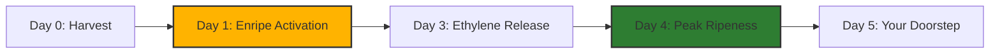

---
tags:
  - shopify
  - ecommerce
  - design
  - ux
  - psychology
created: 2026-04-13
---

# 🛒 Shopify Store Design Strategy: Mango E-commerce

This document outlines the visual and psychological strategy for a premium, naturally-ripened mango store in Chennai. The goal is to bridge the "Tactile Gap" (selling fruit online) and eliminate "Carbide Anxiety."

## 🎨 Visual Identity & Benchmarks

### 1. Visual Language
- **Colors:** Mango Gold (`#FFB300`), Leaf Green (`#2E7D32`), Deep Earth (`#4E342E`).
- **Typography:** Montserrat (Modern, Tech-Safe) or Playfair Display (Luxury, Boutique).
- **Vibe:** "Dopamine Design"—high-saturation, appetite-triggering visuals.

### 2. Design Benchmarks (Inspiration)
| Site                 | Why it Works                                                      | URL                                                                                                                                      |
| :------------------- | :---------------------------------------------------------------- | :--------------------------------------------------------------------------------------------------------------------------------------- |
| **Fruitsmith**       | Luxury Boutique aesthetic; 150-year heritage storytelling.        | [fruitsmith.com](https://fruitsmith.com)                                                                                                 |
| **Frog Hollow Farm** | "Authentic Grit"; uses earthy tones and photos of real farmers.   | [[froghollow.com](https://froghollow.com)](https://www.froghollow.com/?srsltid=AfmBOoqnPoOwoOaRlSBF4DQYYXtlEjSylScwtqHSZcmK6PaODkE58yP8) |
| **Kimaye**           | Modern Indian fruit brand; excellent use of "Safe to Eat" badges. | [kimaye.com](https://kimaye.com)                                                                                                         |
| **Daily Harvest**    | Master of the "Quick Shop" and minimal, grid-based UI.            | [daily-harvest.com](https://daily-harvest.com)                                                                                           |

---

## 🏗️ Visual Wireframes (Mermaid Diagrams)

### The "Trust Stepper" (Homepage/Product Page)
This visual guide builds authority and eliminates fear by showing the FSSAI-approved process.



### The "Flavor Radar" (Variety Selector)
Use this on product pages (e.g., Imam Pasand vs. Banganapalli) to help customers decide.

```mermaid
radar-chart
    title Mango Flavor Profile
    labels [Sweetness, Aroma, Fiber (Low), Creaminess, Tanginess]
    Imam_Pasand: [5, 5, 5, 4, 1]
    Banganapalli: [4, 3, 4, 3, 2]
```

---

## 🧠 Neuromarketing Checklist (Psychological Triggers)

To increase your conversion rate (Benchmark: 4.9% for premium food), implement these triggers:

### 1. Authority & Trust (The "Carbide Antidote")
- **FSSAI Badge:** Display the official FSSAI approval number prominently near the "Add to Cart" button.
- **The "Safety Lab" Page:** Show a 30-second video of the Enripe sachet working.
- **Psychology:** *Expert Endorsement* reduces decision friction.

### 2. Scarcity & Urgency (Seasonal Hype)
- **Batch Countdown:** "Batch #04-Chennai Ripening now. 12 boxes left for Thursday delivery."
- **Variety Drops:** Treat mango varieties like "Fashion Drops." (e.g., "The Imam Pasand Window: Only 14 days left this year.")
- **Psychology:** *Loss Aversion* triggers immediate action.

### 3. Anchoring (Premium Value)
- **Comparison:** Show a "Standard Market Price" vs. your "Premium Certified Price." 
- **The "Boutique" Tier:** Always show a higher-priced Luxury Gift Box ($$$) next to your Standard Box ($$). It makes the Standard Box feel like a "value" deal.
- **Psychology:** *Reference Point Effect* makes the middle option more attractive.

### 4. Bridging the "Tactile Gap" (Sensory Language)
- **Haptic Copy:** Avoid "Tasty Mango." Use "Buttery, fiberless flesh," "Heavy with juice," or "Deep golden aroma that fills the room."
- **Psychology:** *Embodied Cognition* activates the same brain pathways as physical touch.

---

## 🛠️ Feature Roadmap

### Phase 1: The "Trust Store" (MVP)
- [ ] **Zapiet Integration:** Delivery slots tied to ripening batches.
- [ ] **Batch Tracking:** A simple text field where customers can enter their box number to see origin data.
- [ ] **Safety-First UI:** Sticky header with "100% Carbide-Free" guarantee.

### Phase 2: The "Gifting Orchard"
- [ ] **Multi-Address Checkout:** For corporate gifting during mango season.
- [ ] **Gift Message Video:** Allow customers to upload a 10s video greeting for the recipient.

---
[[wiki/mango-research-index\|Back to Index]]
